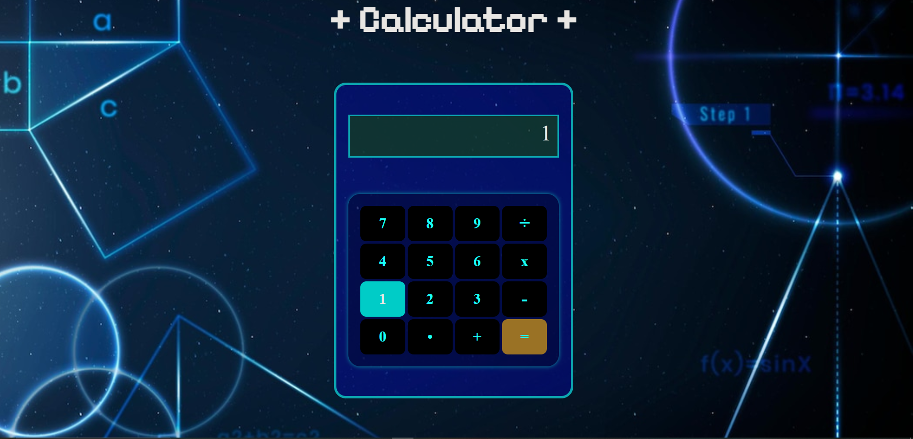

# Simple Calulator

This project is deployed on Vercel at [Simple Calculator](https://coma-calculator.vercel.app/)

## Functionality
The calculator is simple in it's use: `<Number> <operation> <Number> =`  
if this format is used, then a result will be displayed on the screen and you can use the result on the screen as an argument to another operation. 
Chaining of operations is not a function of this calculator

### Tip: Tap the screen to clear it's contents

  

